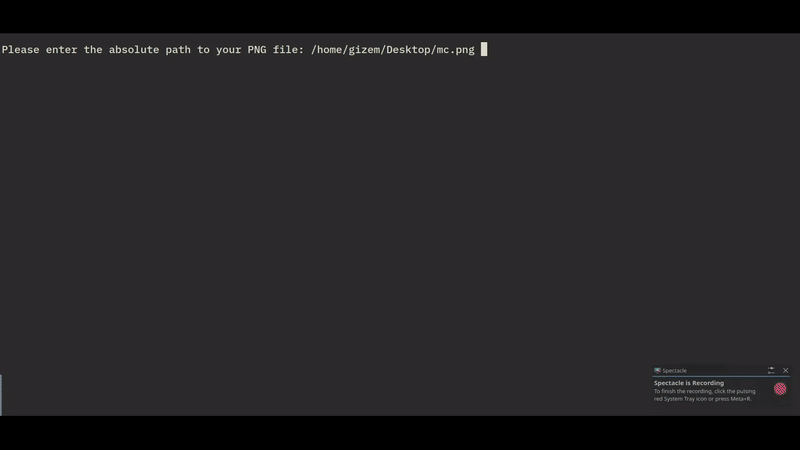

# png_to_cursor

Converts a square PNG into a multi-resolution X11 cursor theme using `stb` libraries and `xcursorgen`.

## Requirements
* C++17 compiler
* `xcursorgen` (`x11-apps` / `xorg-x11-apps` / `xcursor-themes`)
* `stb_image.h`, `stb_image_resize2.h`, `stb_image_write.h` (place in the same directory)

## Build & Run
```bash
g++ -std=c++17 -O2 png_to_cursor.cpp -o png_to_cursor
sudo ./png_to_cursor
```

## How It Works
Validates input PNG (must be square).

Resizes image to standard cursor sizes (16px to 256px).

Prompts for hotspot presets (Top-Left, Center, Custom) and scales coordinates.

Generates theme under /usr/share/icons/<theme_name>/ with a default -> left_ptr symlink.

Automatically cleans up temp files in /tmp.




## Credits / Acknowledgments
* Image loading and writing operations are powered by [stb](https://github.com/nothings/stb) libraries by Sean Barrett (Public Domain / MIT).
